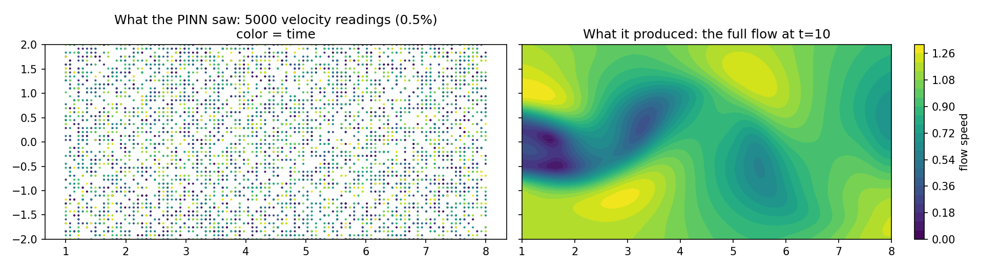
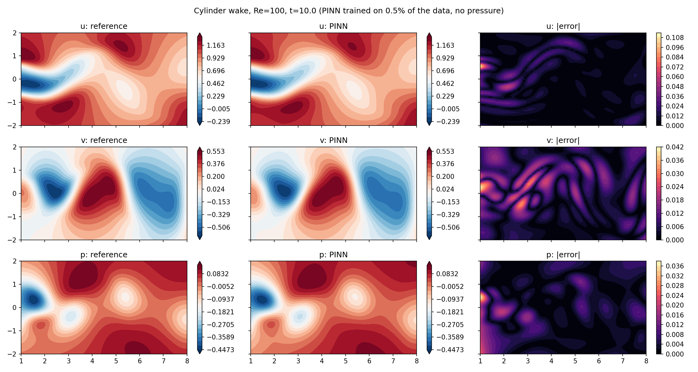
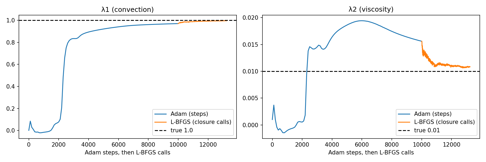
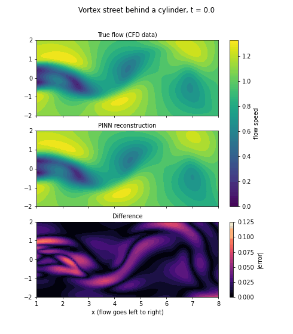

# Cylinder Wake, Inverse Navier-Stokes with a PINN

A physics-informed neural network (pure PyTorch) that looks at **sparse velocity readings** behind a cylinder at Re = 100 and recovers:

- the full **velocity field** (u, v) in space and time,
- the **pressure field**, which the network never sees,
- the two unknown **Navier-Stokes coefficients** (λ1, λ2).

Data: `cylinder_nektar_wake.mat` from [Raissi et al. PINNs repo](https://github.com/maziarraissi/PINNs). Domain: x ∈ [1, 8], y ∈ [-2, 2], t ∈ [0, 19.9].

## The idea in plain words

Imagine 5000 flow-meter readings scattered randomly in space and time (0.5% of the available data). A normal neural network would just interpolate them. The PINN is also told that the flow must obey the momentum equations, so it has to find a smooth flow that fits the readings *and* the physics. As a bonus, the pressure and the coefficients that make the physics work come out of the fit.



## Method

- **Network:** (x, y, t) → (ψ, p), 8 hidden layers × 20 neurons, tanh, 3064 parameters (including λ1, λ2).
- **Stream function:** u = ∂ψ/∂y, v = −∂ψ/∂x, so continuity (u_x + v_y = 0) holds exactly. Only the two momentum residuals are in the loss.
- **Unknowns:** λ1 and λ2 are `nn.Parameter`s trained with the weights (true values 1 and 0.01 = 1/Re). Both start at 0.
- **Loss** = MSE(u, v vs data) + MSE(x- and y-momentum residuals), weights (1, 1). No boundary term; the data replaces it.
- **Residuals:**
  - u_t + λ1 (u u_x + v u_y) = −p_x + λ2 (u_xx + u_yy)
  - v_t + λ1 (u v_x + v v_y) = −p_y + λ2 (v_xx + v_yy)
- **Inputs** are rescaled to [-1, 1] inside `forward()`; autograd still differentiates with respect to the raw x, y, t.
- **Training data:** 5000 random space-time points (seed 0), velocity only.
- **Optimizers:** Adam 10,000 steps (lr 1e-3, ExponentialLR γ = 0.9997), then float64 L-BFGS (history 50, strong Wolfe), 10 rounds of 500 iterations (~5400 closure calls). Every round used its full iteration budget, so L-BFGS had **not** converged when stopped.
- **Pressure** is only defined up to a constant, so it is compared after subtracting each snapshot's mean.

## Results

Mean relative L2 error over 5 snapshots (t = 2, 6, 10, 14, 18), evaluated on all 5000 spatial points of each snapshot:

| Quantity | Error |
|---|---|
| u | 0.85% |
| v | 2.2% |
| p (mean removed) | 4.3% |

| Parameter | Learned | True | Error |
|---|---|---|---|
| λ1 | 0.9971 | 1 | 0.29% |
| λ2 | 0.01091 | 0.01 | 9.1% high |

At t = 10 the maximum absolute errors are 0.109 (u), 0.041 (v) and 0.037 (p), concentrated near the left edge (x ≈ 1) and in the near wake.




Animation of the vortex street (true flow, PINN, difference):



## Limitations (please read)

- **λ2 stayed about 9% high** while the total loss kept falling by 45% over the last four rounds. The cause was not investigated.
- **L-BFGS did not converge;** training was stopped at a fixed cap, not by a convergence test. Field errors were still improving.
- **The validation snapshots are full-grid snapshots,** so about 0.5% of their points were in the training set. The errors are not from a strictly separate test set.
- **Reconstruction, not forecasting:** all snapshots lie inside the training time range.
- **Single seed, single subsample, clean data.** No noise or seed study. A full from-scratch rerun (fresh Colab session, same seed) reproduced every printed number, so the run is deterministic, but that does not test robustness across seeds or subsamples.
- Pressure error grows slightly at later snapshots (about 3.5% at t = 2 to 5% at t = 14 to 18); unexplained.
- The GIF error colorbar is scaled to the worst frame over all frames.
- **Bridge to own CFD data is future work.** No OpenFOAM or Fluent case has been run yet. When one exists, the PINN needs (x, y, t, u, v) in non-dimensional units (cylinder diameter 1, free stream 1), updated `lb`/`ub`, and a few thousand training points.

## Repository structure

```
project6_cylinder_wake/
├── Cylinder_Wake,_Inverse_Navier_Stokes_with_a_PINN.ipynb
├── README.md
├── figures/
│   ├── cylinder_fields.png
│   ├── cylinder_lambda.png
│   ├── cylinder_training_data.png
│   └── cylinder_wake.gif
├── weights/
│   └── pinn_cylinder_final.pt
└── data/          # not committed; download the .mat from Raissi's repo
```

## Run it

Open `Cylinder_Wake,_Inverse_Navier_Stokes_with_a_PINN.ipynb` in Google Colab (GPU runtime) and run the cells top to bottom. Adam takes about 16 minutes and each L-BFGS round about 80 seconds on a Colab GPU.

## Credit

Dataset and the inverse-NS formulation: Raissi, Perdikaris and Karniadakis, *Physics-informed neural networks* (J. Comput. Phys., 2019).
